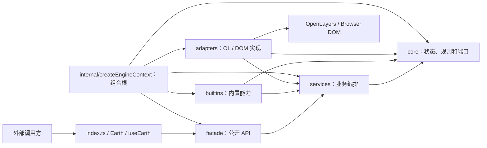

# 项目目录结构说明

本文档说明 `ol-engine` 2.0 当前仓库的目录职责、源码分层、依赖边界和常见扩展位置。内容以 `codex/v2-architecture` 分支的实际结构为准。

## 1. 项目概览

本项目是基于 OpenLayers 的 TypeScript 地图能力库，发布格式为 ESM。外部项目只应通过包根入口和公共样式入口使用：

```ts
import { useEarth } from '@vrsim/earth-engine-ol';
import '@vrsim/earth-engine-ol/style.css';
```

`package.json` 当前只公开以下两个入口：

- `@vrsim/earth-engine-ol`
- `@vrsim/earth-engine-ol/style.css`

`src/` 下的其他路径都属于内部实现，不应在外部项目中深度导入。OpenLayers 由使用方单独安装，当前包将 `ol@^10.9.0` 声明为可选 peer dependency。

## 2. 根目录结构

```text
ol-engine/
├─ src/                       # 库源码
│  ├─ index.ts                # 包根公共导出入口
│  ├─ Earth.ts                # Earth 的薄重导出入口
│  ├─ useEarth.ts             # useEarth 的薄重导出入口
│  ├─ facade/                 # 对外 API 门面
│  ├─ services/               # 业务服务与用例编排
│  ├─ core/                   # 与 OpenLayers、DOM 无关的领域内核
│  ├─ builtins/               # 内置图形、动画和样式
│  ├─ adapters/               # OpenLayers 与 DOM 适配实现
│  ├─ internal/               # Earth 实例装配根
│  ├─ utils/                  # 公共小型工具
│  └─ assets/style/           # 公共样式
├─ test/                      # Vitest、类型测试和浏览器验收测试
├─ .test/                     # 人工验收台与可运行示例
├─ scripts/                   # 文档、打包和质量检查脚本
├─ website/                   # Vue/Vite 用户文档站
├─ docs/                      # 已跟踪的设计方案和实施计划
├─ dist/                      # 构建产物，不提交
├─ .test-output/              # 基于源码构建的验收台产物
├─ .test-output-dist/         # 基于 dist 构建的验收台产物
├─ test-results/              # Playwright 测试结果
├─ index.html                 # 本地公共 API 验收台入口
├─ package.json               # 包入口、依赖和 npm 命令
├─ rollup.config.mjs          # ESM 包构建配置
├─ vite.config.ts             # 本地验收台构建配置
├─ vitest.config.ts           # 完整 Vitest 配置
├─ vitest.code.config.ts      # 排除文档测试的代码回归配置
├─ playwright.config.ts       # 浏览器验收配置
├─ tsconfig*.json             # 源码和类型契约检查配置
├─ typedoc.json               # TypeDoc 生成配置
├─ README.md                  # 项目入口说明
├─ MIGRATION.txt              # V1 到 V2 的迁移说明
├─ PROJECT_STRUCTURE.md       # 当前目录结构说明
├─ AGENTS.md                  # 仓库协作和维护规则
└─ V2_PUBLIC_API.md           # 2.0 公共 API 调用说明
```

## 3. 源码分层

### 3.1 主要调用流程和装配关系



`src/internal/createEngineContext.ts` 是整个运行时的装配入口。它为每个 Earth 创建 OpenLayers Map、核心状态、适配器、服务和公开门面，并按依赖顺序统一销毁资源。

上图表达主要调用流程和装配职责，不是完整的 import 依赖图。实际代码中，`src/index.ts` 还会从 core、builtins、services 和 utils 重导出公共类型或工具；facade 会直接使用 core、adapters、builtins 和 OpenLayers 完成原生对象互操作；`facade/Earth.ts` 会创建 internal context，而 internal 也会装配 facade。部分 adapters 还会复用 services 类型。真正由 `ArchitectureImportGraph.test.ts` 强制执行的导入边界如下：

| 来源层     | 禁止依赖                                                                       |
| ---------- | ------------------------------------------------------------------------------ |
| `core`     | `services`、`builtins`、`adapters`、`facade`、`internal`、旧版目录、OpenLayers |
| `services` | `adapters`、`facade`、`internal`、旧版目录、OpenLayers                         |
| `builtins` | `adapters`、`facade`、`internal`、旧版目录、OpenLayers                         |
| `adapters` | `builtins`、`facade`、`internal`、旧版目录                                     |

`facade` 和 `internal` 位于外层，允许根据公开边界和装配需要组合下层模块。

### 3.2 `src/core`：领域内核

`core` 保存稳定的数据结构、领域规则和环境端口，不直接依赖 OpenLayers、浏览器 DOM、服务层或公开门面。

```text
core/
├─ animation/                 # 动画配置、通道和状态类型
├─ common/                    # 坐标、克隆、销毁和跨世界处理
├─ element/                   # ElementStore、元素状态、选择器和快照
├─ layer/                     # LayerManager 和图层状态
├─ native/                    # 原生对象的不透明引用类型
├─ ports/                     # 输入、绘制、渲染、Overlay、Transform 等端口
├─ shape/                     # ShapeDefinition、能力模型和 ShapeRegistry
├─ style/                     # 结构化 StyleSpec 类型
├─ transaction/               # 元素事务、版本和变更集
└─ errors.ts                  # 对外稳定错误类型
```

适合放在这里的内容：

- 不依赖地图引擎的状态模型和校验规则。
- 服务层需要调用、但不应知道具体 OpenLayers 实现的端口接口。
- 可被多个服务复用的领域类型和纯函数。

不应放在这里的内容：

- `ol/*` 导入。
- `window`、`document` 或 DOM 元素操作。
- 具体工具栏、右键菜单视图和 OpenLayers 交互实现。

### 3.3 `src/services`：业务服务

`services` 负责业务行为和会话生命周期，通过 `core/ports` 使用外部能力，不直接操作 OpenLayers 或 DOM。

```text
services/
├─ animation/                 # 统一动画管理器、句柄和注册表
├─ context-menu/              # 右键菜单注册、状态和行为
├─ draw/                      # 绘制、动态编辑和会话
├─ events/                    # 输入路由、事件分发和交互互斥
├─ measure/                   # 距离、面积测量会话
├─ overlay/                   # Overlay、Descriptor 和句柄
├─ style/                     # 样式校验、替换和局部更新
└─ transform/                 # Transform 会话、历史和撤销重做
```

这里处理“做什么”和“何时做”，具体“怎样操作 OpenLayers 或页面元素”交给适配器。

### 3.4 `src/builtins`：内置能力

`builtins` 保存随包提供的默认能力定义。

```text
builtins/
├─ animations/
│  ├─ index.ts                # 十种内置动画及统一注册
│  └─ *.ts                    # 动画定义、时间线和共享算法
├─ shapes/
│  ├─ basic.ts                # 点、线、面、圆等基础图形
│  └─ plot/                   # 箭头、曲线、多边形等 Plot 算法
└─ styles/
   ├─ lineStyles.ts           # 路径线饰样式工厂
   └─ presets.ts              # 内置样式预设
```

`ShapeRegistry` 和 `AnimationRegistry` 当前是内部扩展点，尚未从包根导出。新增内置图形或动画可以沿注册表机制扩展，但外部用户暂时不能把它们当作插件注册 API 使用。

### 3.5 `src/adapters`：环境适配层

`adapters` 负责把核心状态和服务端口转换为 OpenLayers 或 DOM 的真实行为。

```text
adapters/
├─ dom/
│  ├─ ContextMenuViewAdapter.ts       # 右键菜单视图
│  ├─ TooltipAdapter.ts                # Draw、Edit、Transform 共用提示
│  ├─ TransformToolbarAdapter.ts      # Transform 工具栏
│  └─ transformToolbarIcons.ts        # 内嵌工具栏 SVG
└─ openlayers/
   ├─ FeatureBinding.ts               # ElementState 到 OL Feature 的投影与绑定
   ├─ GeometryCodec.ts                # ShapeState 与 OL Geometry 转换
   ├─ LayerAdapter.ts                 # OL 图层和 Source 管理
   ├─ InputAdapter.ts                 # 地图输入事件转换
   ├─ HitTestAdapter.ts               # 受管 Element 命中检测
   ├─ MeasurementAdapter.ts           # OL 测量能力
   ├─ OverlayAdapter.ts               # OL Overlay 管理
   ├─ NativeRefRegistry.ts            # 原生对象安全引用
   ├─ interactions/                   # Draw、Edit、Transform 交互
   ├─ render/                         # 动画和临时效果渲染通道
   ├─ style/                          # StyleSpec 编译和纹理处理
   └─ transform/                      # Transform 手柄、命中和预览变换
```

新增 OpenLayers 专属逻辑时，应优先放在这里。如果服务层需要调用这项能力，先在 `core/ports` 定义稳定接口，再由适配器实现。

### 3.6 `src/facade`：公开 API 门面

`facade` 是内部服务与外部用户之间的边界，负责公开参数校验、类型收敛、句柄包装和错误语义。

```text
facade/
├─ Earth.ts                    # 聚合地图和全部公开服务
├─ useEarth.ts                 # 获取或创建默认、命名 Earth 实例
├─ earthRegistry.ts            # useEarth 实例注册表
├─ Element.ts / Layer.ts       # 对外实时句柄
├─ *Facade.ts                  # 内部服务到公开对象的转换
├─ *Service.ts                 # 元素、图层、视图和控件实现
└─ *Types.ts / types.ts        # 公开参数、事件和返回值类型
```

对外新增能力时，需要同时检查：

1. 是否应在 facade 提供稳定接口。
2. 是否需要从 `src/index.ts` 导出。
3. 是否补充中文 TypeDoc、使用示例和公共 API 契约测试。
4. 是否避免把内部服务、适配器或注册表直接暴露出去。

### 3.7 `src/internal`：组合根

`internal` 以装配为主，同时承载少量运行时默认配置和适配胶水，不应继续堆积具体业务规则。

- `EngineContext.ts`：描述一个 Earth 实例运行期间持有的地图对象和服务。
- `createEngineContext.ts`：创建核心仓库、图层管理器、适配器、服务、门面和清理顺序。

当新增服务或适配器时，通常需要在 `createEngineContext.ts` 完成依赖注入和销毁注册。

### 3.8 `src/assets/style` 和 `src/utils`

- `assets/style/`：右键菜单、Descriptor、工具栏、提示框及公共样式入口。
- `utils/`：ID、数学函数和 `throttle`。这里只放职责单一、无状态且适合公开复用的小工具。

## 4. 测试与验收目录

### 4.1 `test`

`test/` 是自动化验证目录：

```text
test/
├─ *.test.ts                  # 单元、集成、架构和 API 契约测试
├─ helpers/                   # 测试 Harness 和共享构造函数
├─ fixtures/                  # 消费者项目、能力清单和类型夹具
├─ types/                     # 独立类型契约测试
└─ browser/                   # Playwright 浏览器验收站点和用例
```

重要测试边界：

- `ArchitectureImportGraph.test.ts`：限制各层的导入方向。
- `CoreBoundaries.test.ts`：保证 `core` 不依赖 OpenLayers 和 DOM。
- `PublicApiSnapshot.test.ts`：保护包根导出集合。
- `PublicApiDocumentation.test.ts`：检查公开 API 中文注释、参数、返回值和示例。
- `PackageExports.test.ts`：检查发布包入口和消费方式。
- `test/browser/`：验证真实浏览器中的生命周期和交互行为。

### 4.2 `.test`

`.test/` 是人工验收台，不是 Vitest 单元测试目录：

```text
.test/
├─ app/                       # 验收台应用外壳
├─ scenarios/                 # 按公开能力拆分的测试场景
├─ harness/                   # 场景上下文和资源释放
├─ coverage/                  # 公开 API 示例覆盖检查
├─ main.ts                    # 验收台入口
└─ styles.scss                # 控制面板和地图样式
```

新增或修改公开能力时，应在这里增加可人工操作的场景，尤其是绘制、Transform、动画和右键菜单等视觉交互。

## 5. 文档和自动化目录

### 5.1 `website`

`website/` 是名为 `ol-doc` 的 npm workspace，使用 Vue 和 Vite：

- `src/views/`：用户文档页面。
- `src/examples/`：页面内可运行示例。
- `src/components/docs/`：文档专用展示组件。
- `src/config/`：导航、绘制类型和地图源配置。
- `public/map-sources.json`：公开地图源配置。

网站只保留 2.0 页面和同源示例；1.x 能力差异统一维护在迁移页，不保留不可运行的旧页面副本。

### 5.2 `docs`

`docs/superpowers/specs/` 保存设计方案，`docs/superpowers/plans/` 保存对应实施计划。这里是已跟踪的设计记录，不是当前 TypeDoc 输出目录。

当前 `typedoc.json` 实际将 API Markdown 输出到 `website/public/api/`，并将中间 JSON 写入 `.cache/typedoc.json`。这两个目录都是生成物。

### 5.3 `scripts`

```text
scripts/
├─ docs/
│  ├─ api-docs.mjs                    # 生成网站 API 数据
│  ├─ check-api-coverage.mjs          # 检查公共 API 文档覆盖
│  └─ check-component-api-ownership.mjs # 检查 API 的唯一页面归属
└─ package/
   ├─ assert-package-contract.mjs     # 检查发布包内容与依赖契约
   └─ test-offline-install.mjs        # 验证离线安装和消费
```

## 6. 构建产物和临时目录

以下内容都不应作为普通源码提交：

| 路径                     | 用途                                            |
| ------------------------ | ----------------------------------------------- |
| `dist/`                  | ESM、类型声明、`style.css` 和可能生成的资源文件 |
| `.test-output/`          | 基于源码入口构建的验收台                        |
| `.test-output-dist/`     | 基于 `dist` 入口构建的验收台                    |
| `website/public/api/`    | TypeDoc 生成的 API Markdown                     |
| `website/src/generated/` | 网站生成的 API 数据                             |
| `.cache/`                | TypeDoc 等工具的中间缓存                        |
| `test-results/`          | Playwright 结果和失败追踪                       |
| `node_modules/`          | 根项目依赖                                      |
| `website/node_modules/`  | 文档站依赖                                      |
| `*.tgz`                  | `npm pack` 生成的发布包                         |

## 7. 常见扩展应该放在哪里

| 需求                     | 主要目录                                | 同时检查                                              |
| ------------------------ | --------------------------------------- | ----------------------------------------------------- |
| 新增基础图形或 Plot 图形 | `src/builtins/shapes/`                  | `core/shape` 能力模型、组合根注册、图形测试           |
| 新增统一动画             | `src/builtins/animations/`              | 动画类型、注册表、AnimationManager 测试和验收场景     |
| 新增结构化样式能力       | `src/core/style/`                       | `StyleCompiler`、StyleService、Transform 样式保持测试 |
| 新增 OpenLayers 交互     | `src/adapters/openlayers/interactions/` | `core/ports`、服务会话和交互互斥                      |
| 新增 DOM 工具视图        | `src/adapters/dom/`                     | `src/assets/style/`、资源销毁和多实例隔离             |
| 新增业务服务             | `src/services/`                         | 对应 port、facade、组合根和生命周期测试               |
| 新增公开 API             | `src/facade/`                           | `src/index.ts`、TypeDoc、API 快照和人工验收场景       |
| 新增通用纯工具           | `src/utils/` 或 `src/core/common/`      | 是否需要包根导出及边界测试                            |
| 新增用户文档             | `website/src/views/`                    | 示例、导航、API 表和 `npm run docs:build`             |

## 8. 常用验证命令

| 命令                      | 作用                                       |
| ------------------------- | ------------------------------------------ |
| `npm run typecheck`       | 检查源码类型                               |
| `npm run typecheck:tests` | 检查独立类型契约测试                       |
| `npm run lint`            | 检查源码、测试和验收台代码                 |
| `npm run format:check`    | 检查 Prettier 格式                         |
| `npm run test:code`       | 运行不包含网站文档基线的代码测试           |
| `npm run test:browser`    | 运行 Playwright 浏览器验收                 |
| `npm run demo:check`      | 检查人工验收台的类型、覆盖率和两种构建模式 |
| `npm run build`           | 构建 ESM、类型声明、资源和样式             |
| `npm run test:package`    | 检查发布包、消费方式和离线安装             |
| `npm run verify`          | 执行源码类型、Lint、构建和默认完整 Vitest  |
| `npm run verify:code`     | 执行代码、示例、浏览器和发布包综合门禁     |
| `npm run docs:build`      | 生成并构建网站文档                         |

`npm run test:package` 会先准备 `ol@10.9.0` 消费者缓存，再执行强制离线安装验证，因此整个命令并不等于完全断网运行。

## 9. 维护原则

1. 外部调用只使用包根导出，不依赖内部目录。
2. 领域规则优先放在 `core`，且保持与 OpenLayers、DOM 解耦。
3. 服务通过端口调用外部能力，具体 OpenLayers 和 DOM 行为放在 `adapters`。
4. `internal/createEngineContext.ts` 只做装配和资源清理，不堆积业务规则。
5. 新增图形、动画和样式优先沿注册表或编译器扩展，不在多个服务中重复分支。
6. 新增公开能力时，同时补充类型、中文 TypeDoc、自动化测试和 `.test` 验收场景。
7. 不提交普通 `dist`、TypeDoc、验收台和测试运行产物。
